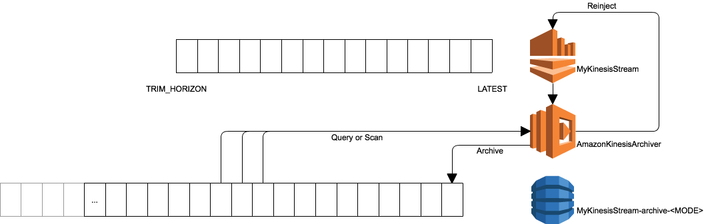

# Kinesis Stream Archiver

Amazon Kinesis provides a family of services for working with streaming data at any scale. Kinesis Streams enables you to build custom applications that process or analyse streaming data for specialised needs. By default, Records of a Stream are accessible for up to 24 hours from the time they are added to the Stream. You can raise this limit to up to 7 days by enabling extended data retention, and you can also [send your Kinesis Streams data to Kinesis Firehose](http://docs.aws.amazon.com/firehose/latest/dev/create-name.html) for long term backup on Amazon S3.

Some applications have the need to be able to reprocess data that is significantly older than the Stream retention period, and would like to be able to 'replay' data into a Stream for subsequent processing. This type of feature allows you to use Kinesis Streams for a 'unified log' or 'log oriented' architecture. In this model, you can use a Stream to build a database of changes carried on the Stream, and consume the sum total or final copies of log messages quickly and easily.

This community built and maintained module, built in AWS Lambda, gives you the ability to accomplish many of the above requirements without having to run additional server infrastructure. It consumes data from an Amazon Kinesis Stream and writes the event records to Amazon DynamoDB, a fully managed and highly durable NOSQL database. When it does this, you can choose whether it keeps all data received, or only the latest record by sequence number for the Stream's Partition Key. You can then use programmatic API's in your software to query or replay data into the original or alternative Kinesis Streams.



## Creating a Stream archive

To get started with this module, simply deploy the function, and mapping to a Kinesis Stream, via the [AWS SAM](https://github.com/awslabs/serverless-application-model) templates below:

| |
| --------------------------|
| [](https://console.aws.amazon.com/cloudformation/home?region=ap-south-1#/stacks/new?stackName=AmazonKinesisArchiver&templateURL=https://s3-ap-south-1.amazonaws.com/awslabs-code-ap-south-1/AmazonKinesisArchiver/deploy.yaml) in ap-south-1 |
| [](https://console.aws.amazon.com/cloudformation/home?region=eu-west-2#/stacks/new?stackName=AmazonKinesisArchiver&templateURL=https://s3-eu-west-2.amazonaws.com/awslabs-code-eu-west-2/AmazonKinesisArchiver/deploy.yaml) in eu-west-2 |
| [](https://console.aws.amazon.com/cloudformation/home?region=eu-west-1#/stacks/new?stackName=AmazonKinesisArchiver&templateURL=https://s3-eu-west-1.amazonaws.com/awslabs-code-eu-west-1/AmazonKinesisArchiver/deploy.yaml) in eu-west-1 |
| [](https://console.aws.amazon.com/cloudformation/home?region=ap-northeast-2#/stacks/new?stackName=AmazonKinesisArchiver&templateURL=https://s3-ap-northeast-2.amazonaws.com/awslabs-code-ap-northeast-2/AmazonKinesisArchiver/deploy.yaml) in ap-northeast-2 |
| [](https://console.aws.amazon.com/cloudformation/home?region=ap-northeast-1#/stacks/new?stackName=AmazonKinesisArchiver&templateURL=https://s3-ap-northeast-1.amazonaws.com/awslabs-code-ap-northeast-1/AmazonKinesisArchiver/deploy.yaml) in ap-northeast-1 |
| [](https://console.aws.amazon.com/cloudformation/home?region=sa-east-1#/stacks/new?stackName=AmazonKinesisArchiver&templateURL=https://s3-sa-east-1.amazonaws.com/awslabs-code-sa-east-1/AmazonKinesisArchiver/deploy.yaml) in sa-east-1 |
| [](https://console.aws.amazon.com/cloudformation/home?region=ca-central-1#/stacks/new?stackName=AmazonKinesisArchiver&templateURL=https://s3-ca-central-1.amazonaws.com/awslabs-code-ca-central-1/AmazonKinesisArchiver/deploy.yaml) in ca-central-1 |
| [](https://console.aws.amazon.com/cloudformation/home?region=ap-southeast-1#/stacks/new?stackName=AmazonKinesisArchiver&templateURL=https://s3-ap-southeast-1.amazonaws.com/awslabs-code-ap-southeast-1/AmazonKinesisArchiver/deploy.yaml) in ap-southeast-1 |
| [](https://console.aws.amazon.com/cloudformation/home?region=ap-southeast-2#/stacks/new?stackName=AmazonKinesisArchiver&templateURL=https://s3-ap-southeast-2.amazonaws.com/awslabs-code-ap-southeast-2/AmazonKinesisArchiver/deploy.yaml) in ap-southeast-2 |
| [](https://console.aws.amazon.com/cloudformation/home?region=eu-central-1#/stacks/new?stackName=AmazonKinesisArchiver&templateURL=https://s3-eu-central-1.amazonaws.com/awslabs-code-eu-central-1/AmazonKinesisArchiver/deploy.yaml) in eu-central-1 |
| [](https://console.aws.amazon.com/cloudformation/home?region=us-east-1#/stacks/new?stackName=AmazonKinesisArchiver&templateURL=https://s3-us-east-1.amazonaws.com/awslabs-code-us-east-1/AmazonKinesisArchiver/deploy.yaml) in us-east-1 |
| [](https://console.aws.amazon.com/cloudformation/home?region=us-east-2#/stacks/new?stackName=AmazonKinesisArchiver&templateURL=https://s3-us-east-2.amazonaws.com/awslabs-code-us-east-2/AmazonKinesisArchiver/deploy.yaml) in us-east-2 |
| [](https://console.aws.amazon.com/cloudformation/home?region=us-west-1#/stacks/new?stackName=AmazonKinesisArchiver&templateURL=https://s3-us-west-1.amazonaws.com/awslabs-code-us-west-1/AmazonKinesisArchiver/deploy.yaml) in us-west-1 |
| [](https://console.aws.amazon.com/cloudformation/home?region=us-west-2#/stacks/new?stackName=AmazonKinesisArchiver&templateURL=https://s3-us-west-2.amazonaws.com/awslabs-code-us-west-2/AmazonKinesisArchiver/deploy.yaml) in us-west-2 |

When creating the Stack, you must supply a Stream ARN, which is the identity for the Kinesis Stream that should be archived, and the Stream Position, which can be one of:

|Setting |Start Position |
| ----|---|
| TRIM_HORIZON | The system will start archiving from the earliest record available, based on the Stream's retention policy) |
| LATEST | The system will start archiving from the next record ingested after the Kinesis Event Source is created and the function deployed |

Once done, you will see that you have a new Lambda function deployed, with name `<Stack Name>-StreamProcessor-<Unique ID>`, and this function will have an Event Source created for the indicated Kinesis Stream.

## Configuring the Archive Mode

Now that the function is set up, we need to tell it how data should be archived for each Stream. Unfortunately we can't yet do this through AWS SAM, so we'll use a script that's part of this project. The Kinesis Archiver knows decides how to archive data based on Tags that are placed on the source Kinesis Stream, which enables a single function to archive a virtually unlimited number of input Streams. To set the archive mode, simply run:

`./bin/setup.sh <Stream Name> <Archive Mode> <region>` with the following options:

* Stream Name - the Name of the Kinesis Stream in the specified Region. Please note this is not the Stream ARN used previously
* Archive Mode - one of `ALL` or `LATEST`. Archive Mode `ALL` will create a full record of all messages from the Stream. `LATEST` will only keep the last copy of a message on the basis of the supplied Stream Partition Key value
* Region - the region where the Kinesis Stream is deployed

Once done, you will be asked a series of questions about how the Archive should be stored in DynamoDB, including whether you want TTL expiration of archive data, and how many read and write IOPS to provision for the archive table.

_Please note that this script requires that you have the [AWS Command Line Interface](https://aws.amazon.com/cli), and a node.js runtime installed on your system_.

## What happens now?

Data from your Kinesis Stream will be routed to the Archiver Lambda function, and then saved into DynamoDB. The DynamoDB table is called ```MyKinesisStream-archive-<MODE>```, where `<MODE>` is one of `ALL` or `LATEST`.

This table has the following structure:

* `partitionKey` - String - this is the partition key specified on the Kinesis PUT event
* `sequenceNumber` - String - this is the Kinesis Sequence Number of the last Record archived into the table for the partitionKey
* `lastUpdate` - String - Timestamp that the last archived record was written to DynamoDB
* `recordData` - String - Base64 encoded string value of the Kinesis record data
* `approximateArrivalTimestamp` - Long - Timestamp expressed as epoch seconds when the message was received by Amazon Kinesis
* `shardId` - String - the Shard ID from which the message was received

If you specify that the archive mode is `ALL`, then the table has a Partition/Sort key of `partitionKey/sequenceNumber`. If you instead specify `LATEST`, then the table will just have Partition key of `partitionKey`, and only the latest `sequenceNumber` will be stored (using a [DynamoDB Conditional Write](http://docs.aws.amazon.com/amazondynamodb/latest/developerguide/WorkingWithItems.html#WorkingWithItems.ConditionalUpdate)).


## Automatically expiring data

The Kinesis Archiver has the ability to automatically remove data from the Stream Archive using the [DynamoDB Time To Live (TTL)](http://docs.aws.amazon.com/amazondynamodb/latest/developerguide/TTL.html) feature, and is probably a good idea to use if you select archive mode `ALL`. When used, it will automatically delete data from DynamoDB based on table attribute:

* `expireAfter` - Long - the timestamp expressed as epoch seconds after which the entry in DynamoDB may be expired by the TTL management process

When the value is found in the Stream configuration, the Archiver will automatically add the `expireAfter` attribute set to the `expireSeconds` after the archival time.

_If you were to change your mind and no longer want TTL applied, you can delete the `expireAfter` attribute from every item in the table_

## Querying data from an archive

You may want to query data that is stored in the archive, which is easy to do from the command line, or programmatically. To access data using simple console tools, you can just run the `bin/queryArchive.js` function, using the following arguments:

```javascript
node queryArchive.js <region> <streamName> <partitionKey> <sequenceNumber> <sequenceNumber> <recordLimit>
```

With the provided arguments:

* region - The AWS Region where the Archive table is stored
* streamName - The name of the Kinesis Stream being archived
* partitionKey - The unique partition key value to be queried
* sequenceNumber (start | end) - The sequence number to extract, or if both sequence number values are provided, the lower sequence number to look for. You can provide an empty string "" to indicate no value. Providing a sequence value for one argument and an empty string for the other will result in a range query being executed
* recordLimit - This will only query the specified number of records from the table

In some cases, you may not know the partition key you are looking for, or may want to issue a more general query. In this case, you'll want to use the `bin/scanArchive.js` script, which is invoked by:

```javascript
node scanArchive.js <region> <stream name> <sequenceStart> <lastUpdateDateStart> <approximateArrivalStart> <recordLimit>
```

With the provided arguments:

* region - The AWS Region where the Archive table is stored
* streamName - The name of the Kinesis Stream being archived
* sequenceStart - The starting sequence number to read records from
* lastUpdateStart - The starting date that the record was archived into the archive table
* approximateArrivalStart - The starting date based upon the timestamp assigned by Amazon Kinesis when the original record was received
* recordLimit - This will only query the specified number of records from the table

## Reprocessing records from an archive

The above query and scan API's are used to give you flexibility on how you replay data back into a Stream. When you push data back into a Stream, it is definitely best practice to consider how your applications will know that the data is not original data, and to deal with it as a 'replay' of previously seen data. To facilitate this requirement, the reinjection model used by this API allows you to request the original message data be reinjected with the original message, which then gives you a contract in your processors that can be used to determine if a message is the correct format and if it is being replayed. When requested, the reinject API's will add the following data to payload before sending the data to the specified Kinesis Stream:

```javascript
{
    "originalApproximateArrivalTimestamp": <approximateArrivalTimestamp>,
    "originalShardId": <shardId>,
    "originalSequenceNumber": <sequenceNumber>,
    "originalStreamName": <streamName> (only added if you are routing to a different stream)
}
```

When using the reinject API's, you must supply a boolean value indicating whether this metadata should be added to replayed messages, and also a 'metadata separator' which is a character you supply to delineate the message metadata from the original message contents. Data stored in the archive is Base64 encoded, but reinjection will decode the data prior to creating the message to be reinjected. For example, if you called a reinject method with `method(true,'|')` and the original data in Kinesis was `HelloWorld`, you would get a value on the target Stream of `|<originalMetadata>|HelloWorld`. The metadata separator is also placed at the beginning of the message, so that serialisers within your application can 'peek' at the first byte (given you use a single byte separator!) and decide on the type of message received:

```javascript
var mysep = "|";

var metadata;
var messagePayload;

// check if the first character of the record matches the separator
if (myKinesisRecord.charAt(0) === mysep) {
	// split the record on the separator
	var elements = data.split(mysep);
	// the first field is empty due to the separator prefix
	metadata = JSON.parse(elements[1]);
	messagePayload = elements[2];
} else {
	// message doesn't have the separator character as the first value, so we'll assume it's an original message
	messagePayload = data;
}
```

It is for this reason that should choose a separator character that is single byte, and is not allowed to be placed at the beginning of your message on the Stream (for instance, an unprintable character etc).

## API Access

The above methods are simplistic interfaces to view data from stdout in a console. For most typical use cases, you will integrate with the query, scan and reinject methods using a programatic interface. All the base interfaces for the API are provided in the `lib/archive-access.js` module, and generally take the same arguments as listed above. However, there is one major difference to consider. Because the query and scan operations in node.js are asynchronous API's this module uses the node.js module [async](https://caolan.github.io/async) to provide data for processing, and a callback method to indicate that all records have been provided by the API. As such, each API takes an argument which is an [async.queue](https://caolan.github.io/async/docs.html#queue) which can be configured to meet your application's requirements around concurrency and processing speed. 

```javascript
queryArchive = function(streamName, partitionKey, sequenceStart, sequenceEnd, recordLimit, recordQueue, callback)
```

In this processing model, you need to follow the workflow:

1. Create an async queue worker, who handles the records received from the archive table. This worker has the signature `function(record, callback)` which is supplied a record from the given API, and then should call the provided callback when processing is completed. Records will only be removed from the async queue once all callbacks have completed
2. Create a marker variable which indicates whether the given API has completed supplying data
3. Create a `queue drain()` function, which is called whenever the queue is emptied. This could be called multiple times during the lifecycle of the queue, given that all queued callbacks could complete but the query method is still running. In this queue drain method, unless the above marker variable has been modified by the API callback, the method is still running.
4. Call the API, and supply the configured queue method. This API must supply a callback which is invoked when the API has completed. It is recommended that this callback set the value of the variable declared in `2` which can then be monitored by the queue drain function.

The integration model for working with these API's can be seen in the example method which services the console API's, such as `queryToCustomConsole`:

```javascript
    queryToCustomConsole = function (streamName, partitionKey, sequenceStart, sequenceEnd, recordLimit, threads,
                                     customConsole, callback) {
        // create a worker method that will be used for the queue callback
        var worker = function (record, wCallback) {
            // decode the data stored in the table
            var data = new Buffer(record.recordData.S, 'Base64').toString(intermediateEncoding);
            // write to the supplied console
            customConsole.log(data);
            wCallback();
        };
        // create the async queue with the requested number of threads
        var queue = async.queue(worker, threads);

        // create a marker variable to indicate whether the query API has supplied all records into the provided queue
        var queryCompleted = false;
        var queryErrors;

        /* create a queue drain method which is signalled every time the queue is emptied. This method will check the
            status of the query completed variable, and only calls the provided callback after 500 milliseconds, which
            will allow the queue to refill with async records if there is a delay in processing */
        queue.drain = function () {
            async.until(function () {
                // we're only done when the queryArchive api calls the final callback. This callback sets the queryCompleted flag to true
                return queryCompleted;
            }, function (untilCallback) {
                // call the provided callback after 500 millis to ensure we allow the queue to refill in case of a race
                setTimeout(function () {
                    untilCallback();
                }, 500);
            }, function (err) {
                callback(err || queryErrors);
            });
        };

        // query the stored archive using the supplied filters
        queryArchive(streamName, partitionKey, sequenceStart, sequenceEnd, recordLimit, queue, function (err) {
            /* once this method has been called, the queryArchive API has completed sending records to the provided
               queue. However, this does not mean that the query workers have finished doing their job with the provided
               records */
            queryErrors = err;
            queryCompleted = true;
        });
    }
```

We hope that the comments in the code are enough information to allow you to create robust applications that work with the asynchronous nature of the API.

## Performing message replay

For message reinjection, the API provides a queue worker which add the required metadata to the original archived message, and then put the records into the Kinesis Stream using a supplied Kinesis API Client. It's interface is:

```javascript
getReinjectWorker = function (sourceStreamName, targetStreamName, includeReinjectMetadata, metadataSeparator, kinesisClient)
```

This interface allows you to create query or scan based access methods for the Archive table, and use the worker to reinject data easily. For example, to replay data based on a scan operation, we can use the example method:

```javascript
    reinjectWithScan = function (sourceStreamName, targetStreamName, sequenceStart, lastUpdateDateStart, approximateArrivalStart, recordLimit, includeReinjectMetadata, metadataSeparator, threads, callback) {
        var scanErrors;
        var scanCompleted = false;

        // get a new reinject worker
        var queue = async.queue(getReinjectWorker(sourceStreamName, targetStreamName, includeReinjectMetadata, metadataSeparator, this.kinesisClient), threads);

        queue.drain = function () {
            async.until(function () {
                return scanCompleted;
            }, function (untilCallback) {
                setTimeout(function () {
                    untilCallback();
                }, 500);
            }, function (err) {
                callback(err || scanErrors);
            });
        };

        // scan through the stored archive using the supplied filters
        scanArchive(sourceStreamName, sequenceStart, lastUpdateDateStart, approximateArrivalStart, recordLimit, queue,
            function (err) {
                scanErrors = err;
                scanCompleted = true;
            });
    };
```

## Support

Please note that the Amazon Kinesis Archiver is a community maintained AWSLabs project, and is not supported directly by Amazon Web Services Support. If you have any problems, questions, or feature requests, please raise an issue here on Github.

----

Amazon Kinesis Archiver

Copyright 2017-2017 Amazon.com, Inc. or its affiliates. All Rights Reserved.

Amazon Software License: https://aws.amazon.com/asl